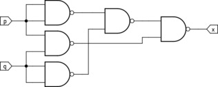
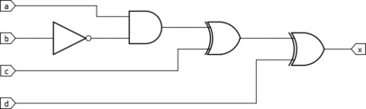
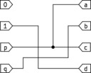
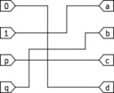
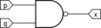
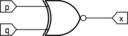
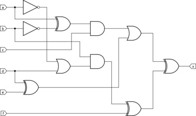

# Universal gates

It is quite well known that any logic circuit can be built using only NAND gates.
For instance, an XNOR gate is equivalent to the following construction:

> 

Such gates are called universal. Any Boolean function with 2 inputs and 1 output can be built from at most 5 NAND gates.

We can also define a gate <i>U</i>21 that is universal in a stricter sense, such that any Boolean
function with 2 inputs and 1 output is realized with just a single copy of <i>U</i>21.
This gate would obviously need more than 2 inputs, but it's usually still more economical than the <i>2k</i> inputs
and <i>k</i> outputs used from a set of NAND chips (1≤<i>k</i>≤5).

> 

As an example, this is how we get the NAND of <i>p</i> and <i>q</i> and the XNOR of <i>p</i> and <i>q</i>
by wiring up <i>U</i>21's four inputs <i>a</i>, <i>b</i>, <i>c</i> and <i>d</i>
to a suitable combination of <i>p</i>, <i>q</i>, 0 and 1:

>  &nbsp; &nbsp; &nbsp; 
>
> ⮟ &nbsp; ⮟ &nbsp; ⮟ &nbsp; ⮟ &nbsp; ⮟ &nbsp; ⮟ &nbsp; ⮟ &nbsp; ⮟ &nbsp; ⮟ &nbsp; ⮟ &nbsp; ⮟
>
>  &nbsp; &nbsp; &nbsp; 

So <i>U</i>21 stands in for any combinatorial logic with 2 inputs and 1 output.
And any Boolean function with 3 inputs and 1 output can be built with at most 3 copies of <i>U</i>21.
But that doesn't stop us from creating a gate <i>U</i>31 that's <i>even</i> more universal
and does so with a single copy when wired correctly:

> 

This repository contains a chip design with four independent gates
<i>U</i>21, <i>U</i>31, <i>U</i>41 and <i>U</i>22
where each <i>Uij</i> can be wired to act as an arbitrary function
with <i>i</i> inputs and <i>j</i> outputs.
It uses the caravel framework and is hardened for the gf180mcuC technology platform.
